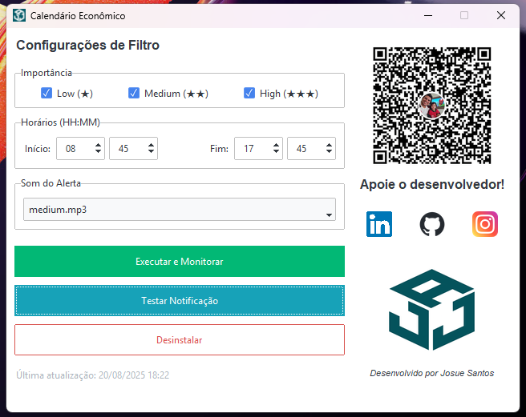
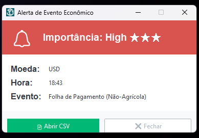

# 🔔 Notificador de Calendário Econômico Investing para Windows


Um aplicativo de desktop robusto e intuitivo, projetado para traders e investidores. Receba notificações em tempo real sobre eventos econômicos importantes investing, com filtros personalizáveis, tradução automática e alertas sonoros customizáveis.

---

## 🖼️ Screenshots

**Interface Principal do Aplicativo**


---

**Exemplo de Notificação de Alerta**


---

## ✨ Funcionalidades Principais

| Funcionalidade | Descrição |
| :--- | :--- |
| **Notificações em Tempo Real** | Receba alertas 5 minutos antes de eventos econômicos importantes investing. |
| **Filtros Personalizáveis** | Escolha eventos por nível de importância (High, Medium, Low) e defina o horário de monitoramento. |
| **Tradução Automática** | Os nomes dos eventos são traduzidos automaticamente do inglês para o português. |
| **Alertas Sonoros Customizáveis**| Escolha o som de alerta que preferir na interface do aplicativo. |
| **Interface Moderna** | Interface limpa e intuitiva construída com `ttkbootstrap` para uma melhor experiência de usuário. |
| **Integração com o Sistema** | O programa cria uma tarefa agendada para iniciar com o Windows e solicita permissão de administrador automaticamente para garantir seu funcionamento. |
| **Modo Background** | Feche a janela principal e o aplicativo continuará monitorando os eventos em segundo plano. |

---

## 🛠️ Tecnologias Utilizadas

*   **Linguagem:** Python 3
*   **Interface Gráfica:** Tkinter com `ttkbootstrap`
*   **Manipulação de Dados:** Pandas
*   **Notificações Sonoras:** Pygame
*   **Tradução:** Googletrans
*   **Empacotamento:** PyInstaller

---

## 🚀 Como Usar (Para Usuários)

1.  **Baixe o Executável:**
    *   Vá para a [**página de Releases**](https://github.com/Josue04Santos/calendario-economico/releases ).
    *   Clique na versão mais recente (ex: `v1.1.0`).
    *   Na seção **Assets**, baixe o arquivo `CalendarioEconomico.exe`.

2.  **Execute o Aplicativo:**
    *   Dê um duplo-clique no arquivo `CalendarioEconomico.exe`.
    *   O Windows solicitará permissão de administrador. Clique em "Sim" (isso é necessário para criar a tarefa agendada).

3.  **Configure e Monitore:**
    *   Na tela principal, configure os filtros de importância e horário.
    *   Escolha seu som de alerta preferido.
    *   Clique em **"Executar e Monitorar"**. O aplicativo irá baixar os dados e começará a rodar em segundo plano. Você já pode fechar a janela.

---

## 👨‍💻 Como Rodar (Para Desenvolvedores)

Se você deseja executar o código-fonte ou contribuir para o projeto, siga estes passos:

1.  **Clone o Repositório:**
    ```bash
    git clone https://github.com/Josue04Santos/calendario-economico.git
    cd calendario-economico
    ```

2.  **Crie e Ative um Ambiente Virtual:**
    ```bash
    # Crie o ambiente
    python -m venv venv
    # Ative no Windows
    .\venv\Scripts\Activate.ps1
    ```

3.  **Instale as Dependências:**
    ```bash
    pip install -r requirements.txt
    ```

4.  **Execute o Script Principal:**
    ```bash
    python calendario_investing.py
    ```

---

## 🤝 Como Contribuir

Contribuições são o que tornam a comunidade de código aberto um lugar incrível para aprender, inspirar e criar. Qualquer contribuição que você fizer será **muito apreciada**.

1.  Faça um Fork do Projeto
2.  Crie sua Feature Branch (`git checkout -b feature/AmazingFeature` )
3.  Faça o Commit de suas mudanças (`git commit -m 'Feat: Add some AmazingFeature'`)
4.  Faça o Push para a Branch (`git push origin feature/AmazingFeature`)
5.  Abra um Pull Request

---

## 📜 Licença

Este projeto está sob a licença MIT. Veja o arquivo `LICENSE` para mais detalhes.

---
**Desenvolvido com ❤️ por Josue Santos**
